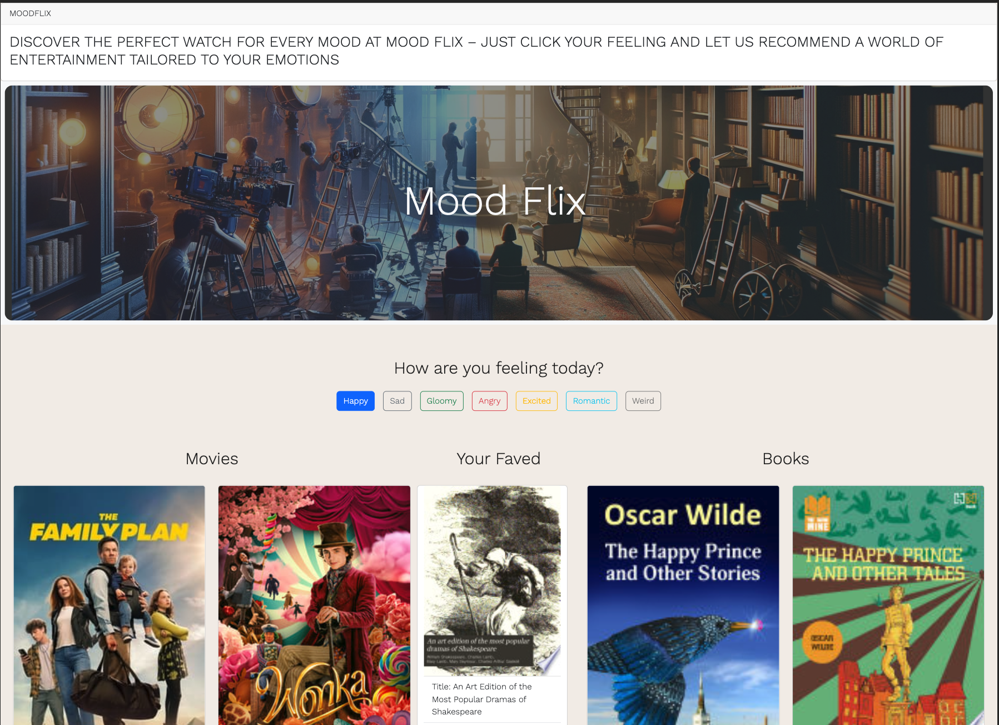

# mood-flix

Tailored Entertainment Recommendations
A website where users can search for books and movies based on their mood amd interest.

In a world where choice overload can make entertainment selections overwhelming, Mood-Flix offers a unique solution. This website is designed to recommend movies and books based on the user's current mood, providing a personalized experience that enhances their leisure time.

#### User Story:

As a user, I want to be able to select my current mood from a range of emotions (like happy, sad, excited, etc.) so that I can receive tailored recommendations for films and books that match how I'm feeling. This feature will help me quickly find content that resonates with my emotional state, saving time and enhancing my entertainment experience.

#### Problem Statement:

Users often struggle to decide what to watch or read, particularly when their choice is influenced by their current mood. The overwhelming number of options available online often leads to decision fatigue, leaving users dissatisfied and disengaged.

#### Solution:

Mood-Flix addresses this issue by offering a user-friendly platform where individuals can select their current mood from a variety of options. The website then utilizes a sophisticated algorithm to suggest films and books that align with the chosen mood. This approach not only simplifies the decision-making process but also ensures a more enjoyable and relevant entertainment experience.

## About this project

In our upcoming project, we as a team will focus on developing key engineering skills. We'll collaborate to design and deploy an interactive front-end application, honing our abilities in technical communication, Git workflows, and conflict resolution in a coding environment. The project also involves adopting agile methodologies and crafting detailed documentation, including user stories and a professional README. Emphasizing practical skills, our project will simulate real-world development scenarios, requiring effective teamwork, decision-making, and presenting our work to simulate pitching to potential stakeholders.

### Built With

- ![HTML]
- ![CSS]
- ![Bootstrap]
- ![JAVASCRIPT]
- ![DAYJS]
- ![JQUERY]
- ![WEBAPI]

### Important note

### Preview

 it will be added later

#### This is the Github page

[mood-flix](https://Sam-Wisdoms.github.io/mood-flix)

### Credits

This is a project for the bootcamp. The starter file is protected by the bootcamp.

### Third-party service

[Bootstrap](https://getbootstrap.com/)
[jQuery](https://jquery.com/)
[day.js](https://day.js.org/)
[Movie API]()
[Google Books API](https://developers.google.com/books/docs/v1/using)

### License

Distributed under the MIT License. See `LICENSE.txt` for more information.

## Contact

Tak Kawamura - [@\_takuyakawamura](https://twitter.com/_takuyakawamura) - tkawamura11@gmail.com

<!-- MARKDOWN LINKS & IMAGES -->
<!-- https://www.markdownguide.org/basic-syntax/#reference-style-links -->

[HTML]: https://img.shields.io/badge/HTML-orange
[CSS]: https://img.shields.io/badge/CSS-blue
[BOOTSTRAP]: https://img.shields.io/badge/BOOTSTRAP-lightblue
[JAVASCRIPT]: https://img.shields.io/badge/Javascript-yellow
[JQUERY]: https://img.shields.io/badge/JQUERY-lightblue
[DAYJS]: https://img.shields.io/badge/DAYJS-orange
[WEBAPI]: https://img.shields.io/badge/WEBAPI-orange
